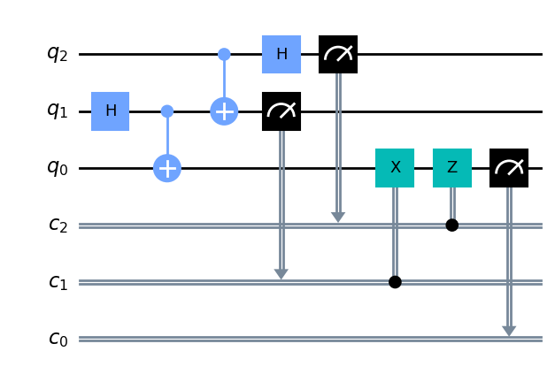

# TeleQ - A Quantum Teleportation Demonstration
**TeleQ** demonstrates secure communication using quantum teleportation, utilizing core principles of quantum mechanics such as entanglement and the no-cloning theorem. Developed with the Qiskit framework, this project highlights the secure transfer of quantum states by taking advantage of the special characteristics of quantum systems.

## Features
- **Quantum Teleportation:** Teleports single bits (0 or 1) using one of four randomly selected Bell states: $|\Phi^+\rangle, |\Phi^-\rangle, |\Psi^+\rangle, |\Psi^-\rangle$.
- **Message Encoding:** Converts an input string into binary, teleports each bit individually, and reconstructs the received binary into readable text.
- **Security:** Demonstrates the inherent security of quantum teleportation via random Bell state selection and quantum mechanical principles.

## Theoretical Background
Quantum teleportation is a process that allows a quantum state to be transferred from one place to another without the need to physically move the particle. This strange phenomenon is based on the principles of **quantum entanglement** and **classical communication**.
### Key Concepts
1. **Quantum Entanglement:**
	- Entanglement is a phenomenon where two or more particles share a quantum state, such that the state of one cannot be described independently of the state of the others.
	- For teleportation, entangled qubits form the foundation. The sender and receiver each hold one qubit of an entangled pair (here, Bell state), which allows the quantum state to be "teleported."
2. **No-Cloning Theorem:**
	- The no-cloning theorem states that it is impossible to create an identical copy of an arbitrary unknown quantum state.
	- This ensures the security of quantum teleportation, as the original quantum state at the sender's end is destroyed during the process.
3. **Classical Communication:**
	- After interacting with the message qubit, the sender transmits two classical bits $(c_1, c_2)$ to the receiver.
	- These classical bits encode the results of measurements performed at the sender's side and guide the receiver in reconstructing the quantum state.

## How TeleQ Works
#### Step-by-Step Process
1. **Prepare Entanglement:**
	- The sender and receiver share an entangled pair of qubits, initialized in one of the four Bell states $(|\Phi^+\rangle, |\Phi^-\rangle, |\Psi^+\rangle, |\Psi^-\rangle)$ chosen randomly.
2. **Encode the Message:**
	- The message qubit is entangled with one of the sender's qubits. If the message bit is 1, an $X-$ gate is applied to the message qubit, otherwise, no operation is performed.
3. **Teleportation:**
	- The sender applies a $CNOT$-gate between the message qubit and their entangled qubit, followed by a Hadamard gate on the message qubit.
	- The sender measures the message qubit and their entangled qubit, resulting in two classical bits $(c_1, c_2)$.
4. **Corrections and Reconstruction:**
	- The receiver uses the classical bits to apply $X-$ and $Z-$gates on their qubit, reconstructing the original quantum state.
5. **Repeat for Each Bit:**
	- Each bit of the binary message undergoes the teleportation process, and the binary data is reconstructed into readable text.
#### View of a Sample Quantum Circuit
This circuit teleports 0 using the $|\Phi^+\rangle$ state. $q_2, q_1, q_0$ and $c_2, c_1, c_0$ are quantum and classical bits for the message, sender and receiver respectively.



## Security Analysis
1. **Random Bell State Selection:**
	- The function randomly selects one of four Bell states for entanglement, making it difficult for an eavesdropper to figure out the correlation.
2. **Classical Channel Uncertainty:**
	- The classical bits $(c_1, c_2)$ alone are insufficient to reconstruct the teleported bit without knowledge of the entangled Bell state.
3. **Probability of Guessing:**
	- The chance of correctly guessing a single bit is $\frac{1}{4}$. For an 8-bit byte:
		$P_{correct}=(\frac{1}{4})^{8}=\frac{1}{65,536}\approx0.0015\%$
	- For longer messages, guessing becomes exponentially improbable.

## Files
This repository includes:
1. A Jupyter Notebook with the application implmentation.
2. A Python executable file with the application implementation.
3. An HTML file containing the preview of the Jupyter Notebook.
4. A quantum circuit image, for embedding into this markdown file.
5. This readme.md file.

## Installation
Ensure the required libraries are installed:
```
pip install qiskit[visualization]==0.43.3
pip install qiskit-aer
```

## Usage
1. **Import Libraries:** Run the cell to import Qiskit libraries:
	```
	from qiskit import QuantumCircuit, QuantumRegister, ClassicalRegister, Aer, execute
	from random import randrange
	```
2. **Define Functions:**
	- `teleport_bit`: Teleports a single bit using random Bell states.
	- `string_to_binary`: Converts strings to binary.
	- `binary_to_string`: Reconstructs binary into text.
3. **Run the Program:**
	- Input a message to teleport.
	- Outputs include:
		- Binary representation of the message.
		- A sample quantum circuit for teleportation.
		- Teleported binary and reconstructed message.

## Output Example
- **Input Message:** `Quantum computing is the future.`
- **Binary Representation:**
	`[0, 1, 0, 1, 1, 0, 1, 0, ...]`
- **Received Bits:**
	`[0, 1, 0, 1, 1, 0, 1, 0, ...]`
- **Reconstructed Message:** `Quantum computing is the future.`

## More Information
This program showcases quantum teleportation for secure communication. Given the current limitations in accessing actual quantum computers and physical quantum channels, this demonstration is conducted on a simulator. While simulators can replicate quantum operations, they cannot physically distribute entangled qubits across different devices, which is crucial for real-world quantum teleportation. Therefore, the entire teleportation process is simulated on a single device.

## About the Author
**Saurabh Suman**<br>
2<sup>nd</sup>-year student (2023-27), Electronics and Telecommunication Engineering Department<br>
Jabalpur Engineering College

[LinkedIn](https://www.linkedin.com/in/saurabhyahihai/)
[Instagram](https://www.instagram.com/saurabh.yahi_hai/)
